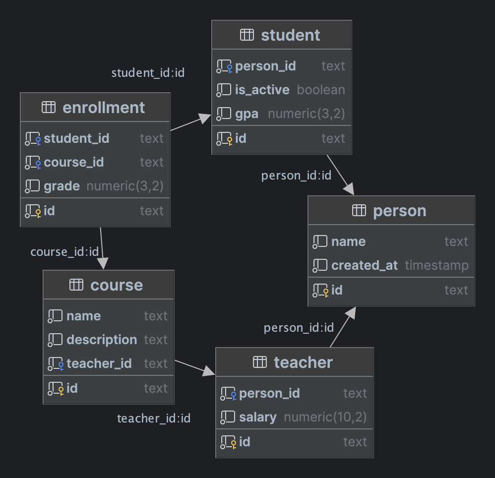
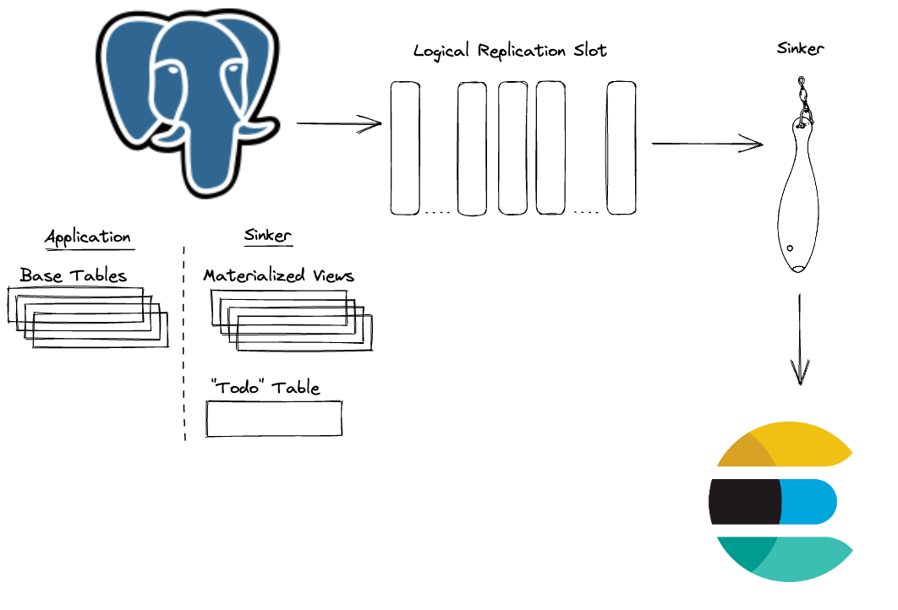

# Sinker: Synchronize Postgres to Elasticsearch

What are you [sinking about](https://www.youtube.com/watch?v=yR0lWICH3rY)?

[](https://pypi.org/project/sinker/)
[](https://github.com/paradigmxyz/sinker/actions/workflows/test.yml)
[](https://codecov.io/gh/paradigmxyz/sinker)
[](https://opensource.org/licenses/MIT)
[](https://opensource.org/licenses/Apache-2.0)

## What is Sinker?

Sinker is middleware that synchronizes relational data from a Postgres database to Elasticsearch.
It is simple to operate, requires minimal RAM, and handles arbitrarily complex schemas.
Sinker is built by [Paradigm](https://www.paradigm.xyz/), and is licensed under the Apache and MIT licenses.

### For Example

In Postgres, you might have a normalized schema like this:

- A Student and a Teacher refer to a Person
- A Course is taught by a Teacher
- Students have and belong to many Courses through the Enrollment join table



In Elasticsearch, you might want to index the Course data in an index called `courses` like this:

```json
{
  "name": "Reth",
  "description": "How to build a modern Ethereum node",
  "teacher": {
    "salary": 100000.0,
    "person": {
      "name": "Prof Georgios"
    }
  },
  "enrollments": [
    {
      "grade": 3.14,
      "student": {
        "gpa": 3.99,
        "person": {
          "name": "Loren"
        }
      }
    },
    {
      "grade": 3.50,
      "student": {
        "gpa": 4.00,
        "person": {
          "name": "Abigail"
        }
      }
    }
  ]
}
```

Now you can easily query Elasticsearch for courses taught by Prof Georgios, or students with high GPAs named Loren.
To do this, you need to do two things reliably:

1. Denormalize the normalized data from the five Postgres tables into a single Elasticsearch document with the Course as
   the parent and the other four tables nested appropriately inside it.
2. Keep the Elasticsearch document in sync with the Postgres data, so that if Abigail changes her name in the database
   to Abby, it's reflected in the `Course->Enrollments->Student->Person.name` field.

## How it Works



Sinker transforms the normalized Postgres data into JSON documents stored in a simple key-value materialized view where
the key is the Elasticsearch document ID and the value is the JSON document to be stored in Elasticsearch.

Sinker creates triggers on the Postgres tables that you want to synchronize (e.g., the five tables in the example
above). When a row is inserted, updated, or deleted in any of these tables, the trigger schedules the materialized view
to be refreshed at the next interval.

The changes to the materialized view are sent to a logical replication slot. Sinker reads from this slot and indexes the
documents in Elasticsearch.

You define the query behind the materialized view, so you can denormalize the data however you want, filter out unwanted
documents, transform some fields, etc. If you can express it in SQL, you can build your materialized view around it.

You also configure the Elasticsearch index settings and mappings however you like.

## Installation

```shell
pip install sinker
```

### Environment Variables

Here are some of the environment variables that you'll want to set:

| Environment Variable    | Value     |
|-------------------------|-----------|
| SINKER_DEFINITIONS_PATH | .         |
| SINKER_SCHEMA           | public    |
| SINKER_POLL_INTERVAL    | 10        |
| SINKER_LOG_LEVEL        | DEBUG     |
| PGPASSWORD              | secret!   |
| PGHOST                  | localhost |
| PGUSER                  | dev       |
| PGDATABASE              | dev_db    |
| ELASTICSEARCH_HOST      | localhost |
| ELASTICSEARCH_SCHEME    | http      |

See sinker/settings.py for the full list.

## Configuration

Sinker's main configuration file `views_to_indices.json` specifies the mapping between the root Postgres materialized
view names and the Elasticsearch indexes that will get populated by them, e.g.:

```json
{
  "person_mv": "people",
  "course_mv": "courses"
}
```

This tells Sinker to define a Postgres materialized view called `person_mv` based on the query in the `person_mv.sql`
file and an Elasticsearch index called `people` based on the settings and mappings in the `people.json` file. It will
then populate the `people` index with the documents from the `person_mv` materialized view. It will then do the same for
the `course_mv` materialized view and the `courses` index.

### Materialized View Configuration

The `person_mv` materialized view is defined by the SQL in the `person_mv.sql` file, e.g.:

```sql
select id, json_build_object('name', "name") as "person"
from "person"
```

The `course_mv` SQL is more complex, but you can see how it denormalizes the data from the five tables into a single
JSON document:

```sql
select id,
       json_build_object(
               'name',
               "name",
               'description',
               "description",
               'teacher',
               (select json_build_object(
                               'salary',
                               "salary",
                               'person',
                               (select json_build_object('name', "name")
                                from person
                                where person.id = person_id)
                           )
                from teacher
                where teacher.id = teacher_id),
               'enrollments',
               (select json_agg(
                               json_build_object(
                                       'grade',
                                       "grade",
                                       'student',
                                       (select json_build_object(
                                                       'gpa',
                                                       "gpa",
                                                       'person',
                                                       (select json_build_object('name', "name")
                                                        from person
                                                        where person.id = person_id)
                                                   )
                                        from student
                                        where student.id = student_id)
                                   )
                           )
                from enrollment
                where enrollment.course_id = course.id)
           ) as "course"
from "course";
```

### Index Configuration

The Elasticsearch index configurations are stored in the `people.json` and `courses.json` files, e.g.:

```json
{
  "mappings": {
    "dynamic": "strict",
    "properties": {
      "name": {
        "type": "keyword"
      }
    }
  },
  "settings": {
    "index": {
      "number_of_shards": "1",
      "number_of_replicas": "0"
    }
  }
}
```

Using `strict` mappings helps ensure the JSON document structure from the materialized view matches what Elasticsearch
expects in the index.

```json
{
  "mappings": {
    "dynamic": "strict",
    "properties": {
      "description": {
        "type": "text"
      },
      "enrollments": {
        "properties": {
          "grade": {
            "type": "float"
          },
          "student": {
            "properties": {
              "gpa": {
                "type": "float"
              },
              "person": {
                "properties": {
                  "name": {
                    "type": "text"
                  }
                }
              }
            }
          }
        }
      },
      "name": {
        "type": "text"
      },
      "teacher": {
        "properties": {
          "person": {
            "properties": {
              "name": {
                "type": "text"
              }
            }
          },
          "salary": {
            "type": "float"
          }
        }
      }
    }
  },
  "settings": {
    "index": {
      "number_of_shards": "1",
      "number_of_replicas": "0"
    }
  }
}
```

### Dry Run

Before running sinker, do a dry run on one of your view-index mappings to verify everything is defined correctly:

1. Execute the SQL query with `LIMIT 1` in the materialized view definition file to see what a sample JSON record will
   look like.
2. Create the destination Elasticsearch index with the settings and mappings in the index configuration file.
3. In Kibana or via cURL, `PUT` the sample JSON record into the Elasticsearch index.
4. Verify the record is indexed as you expect in Elasticsearch.

## Running

Once you have the environment variables and configuration files set up, you can run Sinker with:

```shell
sinker
```

### Performance

Once you have Sinker running, you may well want it to run faster. Here are some things you can do to improve
performance:

1. Decrease `SINKER_POLL_INTERVAL`. This will make Sinker refresh the materialized views more
   frequently (and thus keep Elasticsearch in closer sync), but it will also increase the load on the database. Note
   that the materialized views are only refreshed when one of the underlying tables has changed, so this won't increase
   the load on the database if there are no changes.
2. Increase the `PGCHUNK_SIZE`. This will make Sinker read more rows from the logical replication slot at a time, which
   will reduce the number of round trips to the database. However, it will also increase the memory usage of Sinker.
3. Increase the `ELASTICSEARCH_CHUNK_SIZE`. This will make Sinker index more documents in a single Elasticsearch
   bulk request, which will reduce the number of round trips to Elasticsearch. However, it will also increase the memory
   usage of Sinker and the CPU load on the Elasticsearch cluster.
4. Run `EXPLAIN ANALYZE` on your materialized view queries to see if you can optimize them (e.g., by adding indexes on
   the foreign keys).

## Developing

Before getting started, make sure you have [`poetry`](https://python-poetry.org/docs/)
and [`docker-compose`](https://docs.docker.com/compose/install/) installed.

```shell
% docker-compose --version
Docker Compose version v2.31.0
% poetry --version
Poetry (version 1.8.4)
```

Clone the repo:

```shell
git clone git@github.com:paradigmxyz/sinker.git
cd sinker
```

Install dependencies:

```shell
poetry install
```

Spin up Postgres and Elasticsearch:

```shell
docker-compose --env-file=.env.test up -d
```

Run tests (with -s option to allow more verbose output):

```shell
cp .env.test .env # copy the test environment variables
poetry run pytest -s
```

## Operations

### Docker

To run Sinker as a Docker container, you can use the `docker/` files in this repo as a starting point.
Bundle your views and indices configuration files into the Docker image, set up your environment variables, and deploy.

### Monitoring and Alerting

Setting up monitoring and alerting will give you confidence that Sinker is functioning properly.
For instance, you can periodically check that the row counts in Postgres match the expected document counts in
Elasticsearch.

## Contributing

Contributions are welcome! Please open an issue or submit a pull request.

## Acknowledgements

Sinker was inspired by [pgsync](https://github.com/toluaina/pgsync) and [debezium](https://debezium.io/). Each project
takes a different approach to the problem, so check them out to see which one is best for you.
